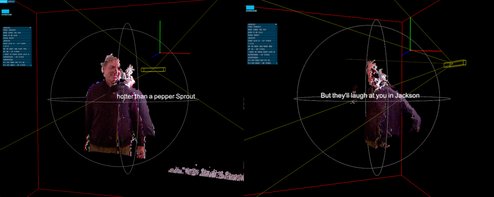

  
   
  
<i><b>3D Karaoke (2012–2026)</b> — Live volumetric performance capture. The body as a digital voxel architecture.</i>

---

# 3D Karaoke (2026 Remix)
### By G.H. Hovagimyan
**Official Site:** [gh.nujus.net](https://gh.nujus.net)

> *"The body is the interface; the code is the score."*

## 🌀 Project Overview
**3D Karaoke** is a foundational work in body-centric interactive performance. Originally realized in 2012 using dual Kinect sensors, this repository is now being re-activated as a "Digital Score" for the modern era.

## 🚀 THE 2026 REMIX: A Call for Collaborators
In coordination with the release of the *Situationist Funhouse* AR monograph, I am looking for creative coders and technical artists to **fork this repo** and port the logic into a modern, hardware-agnostic environment.

### **The Mission:**
* **Sensor Agnostic:** Move from Kinect 360 to modern Lidar (iPhone/iPad) or MediaPipe.
* **Web-Native:** Create ports in **p5.js**, **Three.js**, or **TouchDesigner**.
* **Scalability:** Enable the 3D Karaoke environment to run in-browser or as a mobile AR experience.

## 🤝 How to Contribute
1. **Fork** this repository.
2. **Experiment** with a modern port (p5.js, Unity, or WebXR).
3. **Reach out** via the **Rhizome Discord** (@GHHovagimyan) or submit a Pull Request.

Selected remixes will be featured in the digital layer of the **Situationist Funhouse Limited Edition (30 Copies)**.

---
[Visit gh.nujus.net](https://gh.nujus.net) | [Situationist Funhouse Project](https://gh.nujus.net)
